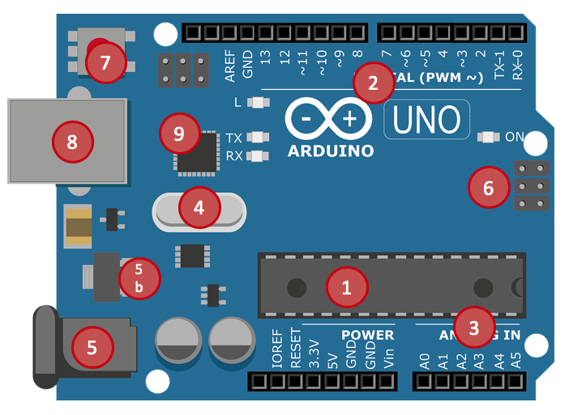

# ARDUINO

## COS'E' ARDUINO

Arduino è una piattaforma open-source di prototipazione elettronica basata su hardware e software flessibili e facili da usare. È progettato per consentire a persone con competenze tecniche varie, compresi i principianti, di creare progetti interattivi e dispositivi elettronici. La piattaforma include una scheda di sviluppo, chiamata "Arduino board", che può essere programmata attraverso un linguaggio di programmazione derivato da C/C++.

Le schede Arduino sono dotate di ingressi e uscite digitali e analogiche che consentono agli utenti di collegare sensori, attuatori e altri componenti elettronici. La comunità di Arduino ha sviluppato una vasta gamma di librerie e shields (schede di espansione) per semplificare la creazione di progetti, rendendo Arduino una scelta popolare per gli hobbisti, gli studenti e gli appassionati di elettronica.

## COMPONENTI HARDWARE

## 
